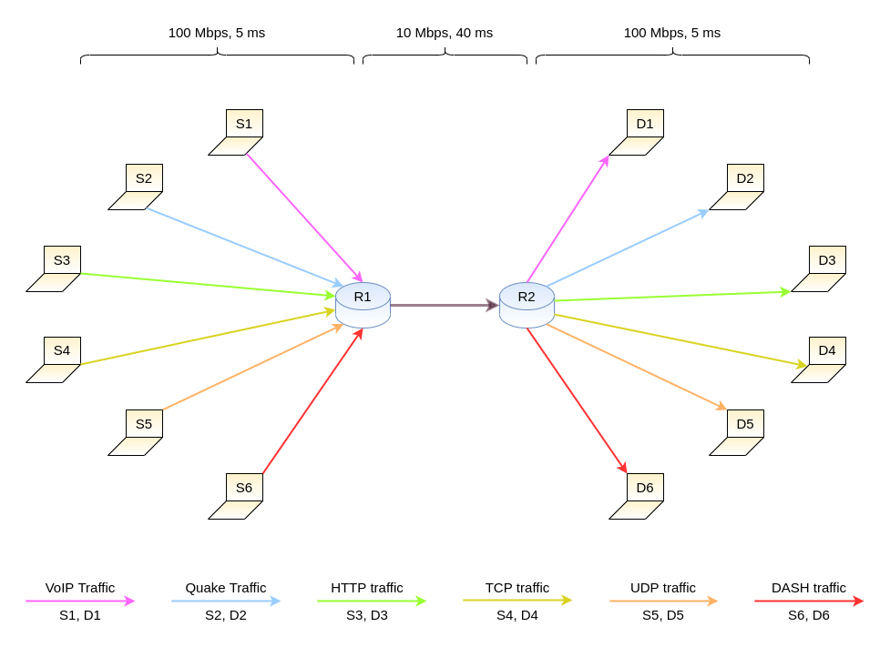

<h1 align="center">
  <br>
  
  <br>
  EvalAQM
  <br>
</h1>

<h4 align="center">A testbed-based <a href="https://en.wikipedia.org/wiki/Shamir%27s_Secret_Sharing" target="_blank">AQM</a> evaluation tool with realistic traffic</h4>

<h4 align="center">Created By <a href="https://github.com/hrishikeshathalye" target="_blank">Hrishikesh Athalye</a>, <a href="https://github.com/Prathamesh-Mone" target="_blank">Prathamesh Mone</a> & <a href="https://github.com/chetasborse" target="_blank">Chetas Borse</a> </h4>

<p align="center">
  <a href="#about">What Is EvalAQM?</a> •
  <a href="#working">How It Works</a> •
  <a href="#topology">Example Topology</a> •
  <a href="#installation">Installation</a> •
  <a href="#configuration file">Configuration File</a> •
  <a href="#credits">Credits</a> •
  <a href="#developers">Developers</a>
</p>

## About

EvalAQM is a realistic traffic based AQM evaluation suite. It aggregates a variety of traffic generators under a single application and helps test AQM mechanisms under realistic traffic. It features a dumbbell topology whose parameters can be changed with a configuration file to change network parameters on the fly. It can also aggregate results and generate graphs once the testing completes.
The graphs generated using this tool as a part of AQM analysis can be found here - <a>https://chetasborse.github.io/AQMEvaluationGraphs</a>

## Working

1. Topology Setup

The code uses NeST (Network Stack Tester) in order to generate the virtual network topology. The topology is a dumbbell topology compirising 2 routers and 6 source and destination nodes. The AQM is employed at the first router which is changed in every iteration of the experiment.

2. Traffic Generation

EvalAQM has support for the following types of traffic - <a href="https://en.wikipedia.org/wiki/Voice_over_IP">VoIP</a>, <a href="http://caia.swin.edu.au/reports/021220A/">Quake</a>, <a href="https://developer.mozilla.org/en-US/docs/Web/HTTP">HTTP</a>, <a href="https://en.wikipedia.org/wiki/Transmission_Control_Protocol">TCP</a>, <a href="">UDP</a> and ABR streaming using <a href="https://www.cloudflare.com/en-in/learning/video/what-is-mpeg-dash/">DASH</a> .

EvalAQM uses Flent under the hood which uses the following traffic generators in order to generate different kinds of traffic:
1. VoIP - <a href="https://github.com/heistp/irtt">irtt</a>
2. Quake - <a href="https://github.com/jbucar/ditg">D-ITG</a>
3. HTTP - <a href="https://github.com/tohojo/http-getter">HTTP Getter </a>
4. TCP - <a href="https://github.com/HewlettPackard/netperf">netperf</a>
5. UDP - <a href="https://iperf.fr/">iperf</a>
6. DASH - <a href="https://github.com/Dash-Industry-Forum/dash.js">Dash.js Reference Client</a>

Flent also aggregates results from these traffic generators and creates .flent.gz files. Upon completion of all tests our code uses gnuplot in order to re-plot the graphs and stores them in a folder called Graphs.
It can optionally also generate bandwidth consumption graphs using data obtained from tcpdump.

## Topology



## Installation

To clone and run this application, you'll need [Git](https://git-scm.com) installed on your computer. From your command line:

```bash
# Clone this repository
$ git clone --recursive git@github.com:hrishikeshathalye/EvalAQM.git
```

The project comes with a single install script to install all dependencies and the DASH dataset. The script can be run as follows. Once the script completes, the DASH dataset will be present inside a folder called bbb and all other dependencies will have been installed.

```bash
# Go into the repository
$ cd EvalAQM

# Install all dependencies
$ chmod +x setup.sh
$ sudo ./setup.sh
```

```bash
# Once the installation is complete the project can be run by using the following command:
$ sudo python testTopology.py
```

## Configuration File
The configuration file has the structure shown below. The file can be modified in order to test for different combinations of bandwidth and delay.

```
[DEFAULT]
HtoRbandwidth = 100mbit (Host to Router Bandwidth, typically the non-bottleneck bandwidth)
HtoRdelay = 5ms (Host to Router Delay, typically the non-bottleneck delay)
RtoRbandwidth = 10mbit (Router to Router Bandwidth, typically the bottleneck bandwidth)
RtoRdelay = 40ms (Router to Router Bandwidth, typically the bottleneck delay)
Duration = 60 (Duration of the test in seconds)
AppArmorDisable = 0 (Whether to call a script to disable AppArmor for tcpdump, recommended for the first time run)
RtoRlimit = 400 (The buffer size at the first router in packets)
AQM = pfifo,codel,pie,cobalt,fq_codel,fq_pie,cake (The AQM mechanisms to test for, comma seperated)
```

## Credits

This software uses the following open source packages:

- [NeST](https://nest.nitk.ac.in/)
- [Flent](https://nodejs.org/)
- [tcpdump](https://reactjs.org/)
- [netperf](https://github.com/HewlettPackard/netperf)
- [iperf](https://iperf.fr/)
- [irtt](https://github.com/heistp/irtt)
- [D-ITG](https://github.com/jbucar/ditg)
- [Dash.js](https://github.com/Dash-Industry-Forum/dash.js)

## Developers

- [Hrishikesh Athalye](https://github.com/hrishikeshathalye)
- [Prathamesh Mone](https://github.com/Prathamesh-Mone)
- [Chetas Borse](https://github.com/chetasborse)
