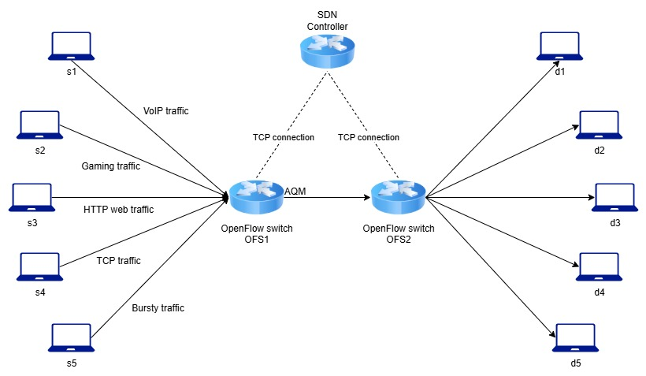

<h4 align="center">A testbed-based <a href="https://en.wikipedia.org/wiki/Shamir%27s_Secret_Sharing" target="_blank">AQM</a> performance evaluation project with realistic application traffic</h4>

<p align="center">
  <a href="#about">What Is this project?</a> •
  <a href="#working">How It Works</a> •
  <a href="#topology">Example Topology</a> •
  <a href="#installation">Installation</a> •
  <a href="#configuration file">Configuration File</a> •
  <a href="#credits">Credits</a>
</p>

## About

This project is a application traffic based AQM performance evaluation suite in SDN network topology. It combines a variety of traffic generator tools and helps test AQM mechanisms under realistic application traffic. The topology parameters can be changed in the configuration file to dynamically change the network setting. It can also aggregate results and generate graphs once the tests complete.

## Working

1. Topology Setup

Mininet network simulator tool is used to generate the virtual network topology. The topology consists of 5 source and destination hosts, 2 OpenFlow switches and a SDN controller. The controller used is Ryu python-based controller which will be configured on a remote machine. The AQM is configured at the first OpenFlow switch, which is changed in every iteration of the experiment.

2. Traffic Generation

The following types of application traffic will be generated - <a href="https://en.wikipedia.org/wiki/Voice_over_IP">VoIP</a>, <a href="http://caia.swin.edu.au/reports/021220A/">Quake</a>, <a href="https://developer.mozilla.org/en-US/docs/Web/HTTP">HTTP</a>, <a href="https://en.wikipedia.org/wiki/Transmission_Control_Protocol">TCP</a> and <a href="">UDP</a>.

This project uses Flent tool which internally uses the following traffic generators in order to generate different kinds of traffic:
1. VoIP - <a href="https://github.com/heistp/irtt">irtt</a>
2. Quake - <a href="https://github.com/jbucar/ditg">D-ITG</a>
3. HTTP - <a href="https://github.com/tohojo/http-getter">HTTP Getter </a>
4. TCP - <a href="https://github.com/HewlettPackard/netperf">netperf</a>
5. UDP - <a href="https://iperf.fr/">iperf</a>

Flent can also aggregate results from these traffic generators and creates .flent.gz files in the data folder. Upon completion of all tests, a tool named gnuplot is used to re-plot the graphs and store them in a folder called Graphs. Bandwidth consumption graphs are separately generated using data collected from tcpdump utility.

## Topology



## Installation

To clone and run this application, you'll need [Git](https://git-scm.com) installed on your computer. From your command line:

```bash
# Clone this repository and checkout SDN branch
$ git clone --recursive git@github.com:hrishikeshathalye/EvalAQM.git
$ git checkout SDNTopology
```

The project comes with a single setup script to install all the required dependencies.

```bash
# Go into the repository
$ cd EvalAQM

# Install all dependencies
$ chmod +x setup.sh
$ sudo ./setup.sh
```

```bash
# The project can be run by using the following command:
$ sudo python3 testSDNTopology.py
```

## Configuration File
The configuration file has the structure shown below. The file can be modified in order to test for different combinations of bandwidth and delay.

```
[DEFAULT]
HtoRbandwidth = 100mbit (Host to OpenFlow switch Bandwidth)
HtoRdelay = 5ms (Host to OpenFlow switch Delay)
RtoRbandwidth = 10mbit (OpenFlow switch to switch Bandwidth)
RtoRdelay = 40ms (OpenFlow switch to switch Delay)
Duration = 60 (Duration of the test in seconds)
AppArmorDisable = 0 (Whether to call a script to disable AppArmor for tcpdump, recommended for the first time run)
RtoRlimit = 400 (The buffer size at the first router in packets)
AQM = pfifo,codel,pie,fq_codel,fq_pie,cake (The AQM mechanisms to test for, comma seperated)
```

On a separate machine, clone Ryu SDN controller repository and install it from <a href="https://github.com/faucetsdn/ryu" target="_blank">here</a>.

## Credits

This software uses the following open source packages:

- [Mininet](https://mininet.org/walkthrough/)
- [Flent](https://nodejs.org/)
- [OpenFlow](https://opennetworking.org/wp-content/uploads/2014/10/openflow-spec-v1.3.0.pdf)
- [Ryu](https://ryu.readthedocs.io/en/latest/getting_started.html)
- [tcpdump](https://reactjs.org/)
- [netperf](https://github.com/HewlettPackard/netperf)
- [iperf](https://iperf.fr/)
- [irtt](https://github.com/heistp/irtt)
- [D-ITG](https://github.com/jbucar/ditg)